# UZHAVAN 360 — LEVEL 1 PROJECT ARCHITECTURE

**System Designation:** UZHAVAN 360  
**AI Assistant Call / Wake Name:** "Uzhavan"  
**Document Level:** Level 1 — Project Architecture & Specification (Single Source of Truth)  
**Status:** Approved Architectural Baseline  

---

# 1. Executive Product Summary

**Uzhavan 360** ("Connecting Farms, Nourishing Lives") is a hyper-local, production-grade agricultural marketplace and operational intelligence platform designed to eliminate predatory middlemen, minimize preventable harvest loss, valorize agricultural byproducts, and empower regional farmers through native voice-first AI control.

At its core, Uzhavan 360 links smallholder and commercial farmers directly with retail, bulk, and commercial buyers using an interactive, Google Maps-driven discovery experience. Unlike legacy agri-tech bulletin boards or standard e-commerce carts, Uzhavan 360 is engineered as an **actionable, high-trust negotiation and reservation marketplace** backed by an auditable inventory ledger, atomic concurrency guarantees, and dual-channel execution: every business action is equally accessible via an intuitive mobile-first graphical interface or through **Uzhavan**, a bilingual (Tamil, English, and Tanglish) conversational AI control layer that shares the identical service boundary, authorization logic, and business rules.

---

# 2. Problem Definition

The Indian agricultural supply chain suffers from structural inefficiencies:
1. **Middleman Monopsony & Price Distortion:** Regional aggregators (agents/brokers) capture 35% to 65% of end-market margins, while smallholder farmers lack direct visibility into real localized buyer demand.
2. **Post-Harvest Loss from Perishability Mismatches:** Fresh perishable produce lacks dynamic urgency pricing and localized discovery, causing tons of edible produce to spoil on farms while nearby consumers buy refrigerated transit produce at inflated prices.
3. **Byproduct Stigmatization & Burning:** Agricultural residues (paddy straw, sugarcane bagasse, coconut husks, banana pseudostems) are treated as disposable waste and burned—causing catastrophic seasonal air pollution—simply because farmers lack a localized discovery channel for bio-energy, paper, craft, and mulching buyers.
4. **The Agri-Tech Digital Literacy Barrier:** Existing e-commerce software demands complex typing, nested form navigation, and strict linguistic compliance. Rural farmers struggle with standard web UX, demanding a zero-friction, voice-first Tamil/English native assistant capable of executing complex business workflows without manual form-filling.
5. **Phantom Inventory & Unreliable Commitments:** Informal phone commitments lead to rampant buyer no-shows and phantom stock. When a buyer fails to collect agreed produce, the farmer is left with rotting inventory and zero recourse.

---

# 3. Target Users

| User Persona | Key Characteristics | Primary Pain Point | Core Need in Uzhavan 360 |
| :--- | :--- | :--- | :--- |
| **Smallholder Farmer (< 5 Acres)** | Mobile-first (Android), Tamil-dominant, high oral literacy, low textual form-filling comfort. | Predatory farmgate prices; volatile perishability; lack of transport. | Voice-controlled listing via "Uzhavan", farmgate pickup requests, fair local pricing. |
| **Commercial / Progressive Farmer** | Multi-crop yield, tech-literate, sells both primary produce and high-volume harvest byproducts. | Finding industrial buyers for crop residues; coordinating multiple concurrent orders. | Batch inventory control, byproduct valorization, automated demand matching ("Sell My Harvest"). |
| **Retail Buyer / Household Consumer** | Mobile-native, urban/semi-urban, prioritizes freshness, distance, and direct-farm traceability. | Supermarket produce is days old and chemically treated; lack of farm-origin transparency. | Google Maps discovery of nearby farmers, freshness badges, direct order requests. |
| **B2B Bulk Buyer (Restaurant, Retailer, Processor)** | Price-sensitive, reliability-focused, requires predictable volume (50 kg – 5,000 kg). | Inconsistent supply, flakey suppliers, lack of reserved quantities. | Transparent reservation model, atomic batch availability, direct farmer communication. |
| **Platform Administrator** | Operational supervisor, dispute arbiter, trust and safety regulator. | Platform abuse, fake listings, location spammers, abandoned orders. | Audit logs, moderation queues, verified farmer certification, demand signal monitoring. |

---

# 4. Product Vision

To establish an equitable, transparent, and frictionless agricultural ecosystem where:
- A farmer can stand in a field, speak naturally in Tamil or English to **Uzhavan**, and instantly list produce, adjust prices, or close reservations.
- Every kilogram of harvested crop and harvest residue finds its highest-value local buyer before spoilage occurs.
- Geographic proximity, transparent reservation states, and verifiable harvest dates supersede speculative middleman pricing.

---

# 5. Core Product Pillars

```
┌─────────────────────────────────────────────────────────────────────────────────┐
│                                   UZHAVAN 360                                   │
├──────────────────────┬──────────────────────┬───────────────────┬───────────────┤
│   1. Direct Farmer-  │  2. Uzhavan AI Voice │ 3. Market Demand  │ 4. Byproduct  │
│   Buyer Marketplace  │      Assistant       │   Intelligence    │   Marketplace │
│ (Map-First Discovery │ (Tamil/Eng/Tanglish, │ (Hyper-local real │ (Residues to  │
│  & Atomic Ledgers)   │ Headless Service Ops)│ marketplace data) │  wealth/value)│
└──────────────────────┴──────────────────────┴───────────────────┴───────────────┘
```

1. **Direct Farmer-to-Buyer Marketplace:** Geographically grounded discovery via Google Maps with strict two-phase request-reservation lifecycles that protect farmer stock from phantom allocations.
2. **Uzhavan Multilingual AI Control Layer:** A voice and text AI agent capable of parsing intent, resolving ambiguities, executing backend service tools under strict RBAC, and driving UI navigation across Tamil, English, and Tanglish.
3. **Market Demand Intelligence:** Real-time extraction of unfulfilled and active buyer request trends within localized geographic radiuses, providing directional signals (Increasing, Stable, Decreasing) to inform farmer planting and harvesting decisions without speculative financial claims.
4. **Harvest Byproduct Marketplace:** Dedicated secondary trading platform for crop residues (paddy straw, bagasse, banana stems, farm manure), converting ecological hazards into supplementary income streams.

---

# 6. User Roles & Responsibilities

| Role | Permissions & Responsibilities | Scope Boundary |
| :--- | :--- | :--- |
| **Farmer (`ROLE_FARMER`)** | Manage profile and farm location (fuzzed for public map, precise for confirmed orders); list/edit/delete agricultural produce and byproducts; manage inventory batches; review incoming buyer requests (accept/reject); fulfill orders; mark buyer no-show; log off-platform sales; access demand signals and "Sell My Harvest" recommendations. | Strictly scoped to own products, batches, requests, orders, and ledger entries. |
| **Buyer (`ROLE_BUYER`)** | Browse marketplace map/list; filter produce by distance, price, category, and freshness; initiate purchase requests to specific farmers; confirm requested quantities upon farmer acceptance; cancel orders within valid states; view order fulfillment instructions; review transaction history. | Strictly scoped to own profile, initiated requests, confirmed orders, and public listings. |
| **Admin (`ROLE_ADMIN`)** | Platform moderation; farmer verification badge approval; dispute and audit log inspection; demand signal metric monitoring; platform health maintenance. | Full read/write over system catalogs, verification states, and administrative overrides. Cannot impersonate user voice sessions. |

---

# 7. Complete Buyer Journey

1. **Discovery & Location Selection:** The buyer opens Uzhavan 360 and enables GPS. Google Maps renders dynamic markers of nearby farmers within a selected radius (e.g., 10 km, 25 km, 50 km).
2. **Multi-Factor Filtering:** The buyer filters results by crop category, price range, freshness rating ("Fresh Harvest", "Sell Soon"), or farmer verification status.
3. **Farmer & Batch Inspection:** Clicking a map pin or list card opens the Farmer Details view, displaying verified badges, farm overview, distance, harvest batches, harvest dates, available quantities, and prices.
4. **Purchase Request Initiation (Phase 1):** The buyer clicks "Send Request" for a specific product. At this stage, **no quantity is committed and no inventory is deducted**. The request enters `REQUESTED`.
5. **Farmer Acceptance Notification:** The farmer receives the request and accepts it. The request state becomes `ACCEPTED`. The buyer receives an immediate in-app and WebSocket alert.
6. **Quantity Confirmation & Atomic Reservation (Phase 2):** The buyer enters required volume (e.g., 50 kg). The system atomically verifies $Q_{\text{requested}} \le Q_{\text{available}}$ and reserves the stock. The order moves to `RESERVED` with a 12-hour expiration window.
7. **Fulfillment & Direct Handover:** The buyer receives the exact farmgate pickup location and contact details, visits the farm, inspects produce, and pays the farmer directly.
8. **Completion:** The farmer marks the order completed (via UI or voice). Reserved stock permanently transitions to sold stock.

---

# 8. Complete Farmer Journey

1. **Onboarding & Farmgate Setup:** Farmer signs up with mobile number and sets farm location (which is automatically fuzzed for the public map).
2. **Produce Listing via Voice or UI:** Farmer says: *"Uzhavan, என்னிடம் 500 கிலோ தக்காளி இருக்கு. 30 ரூபாய்க்கு list பண்ணு"* (I have 500 kg tomatoes. List them for ₹30/kg). Uzhavan confirms details (harvest date, packaging, unit) and creates the listing.
3. **Incoming Request Triaging:** Farmer receives real-time notification: *"Buyer Arun requested Tomatoes."* The farmer reviews the request and clicks "Accept" (or tells Uzhavan *"Accept Arun's request"*).
4. **Quantity Lock & Reservation Tracking:** Once the buyer specifies 100 kg, the farmer's inventory automatically shifts: 500 kg total $\to$ 400 kg available, 100 kg reserved.
5. **Fulfillment Scenarios:**
   - **Scenario A (Standard Pickup):** Buyer arrives and pays. Farmer tells Uzhavan: *"Arun bought 100 kg. Mark completed."* Reserved stock becomes sold.
   - **Scenario B (Buyer No-Show):** Buyer fails to show up within the grace period. Farmer marks "No-Show" or tells Uzhavan: *"Arun didn't come."* The 100 kg reservation is released back to available stock.
   - **Scenario C (Off-Platform Sale):** A neighbor buys 150 kg cash at the farmgate. Farmer tells Uzhavan: *"Sold 150 kg offline."* Available stock drops from 400 kg to 250 kg cleanly.
6. **Residue Monetization:** Post-harvest, the farmer lists 2 tons of paddy straw under Byproducts using voice. Industrial buyers nearby discover and request the straw.
7. **Flagship "Sell My Harvest":** Farmer asks: *"Uzhavan, sell my harvest."* Uzhavan analyzes local demand signals, matches unfulfilled buyer requests within 30 km, and proposes actionable sales opportunities.

---

# 9. Complete Uzhavan Journey

Uzhavan functions as a seamless, context-aware AI orchestrator executing identical backend domain services:
1. **Wake/Activation:** Activated by calling "Uzhavan" or tapping the persistent microphone button.
2. **Speech Recognition (ASR):** Audio input is transcribed, supporting Tamil, English, and Tanglish (code-switching).
3. **Intent & Entity Parsing:** An LLM function-calling engine identifies the user's intent (e.g., `CREATE_PRODUCT`, `ACCEPT_REQUEST`, `RECORD_OFFLINE_SALE`, `QUERY_DEMAND`) and extracts arguments (crop, quantity, unit, price).
4. **Context & Disambiguation:** If parameters are missing (e.g., price omitted), Uzhavan prompts back conversationally in the user's language: *"What is the price per kg?"*
5. **Security & Authorization Interception:** The orchestrator injects the authenticated session's user ID and role. The requested tool is validated against RBAC rules and ownership boundaries.
6. **Confirmation Guard for Sensitive Actions:** Irreversible operations (e.g., deleting listings, cancelling reservations, large offline sales) prompt for explicit confirmation before executing.
7. **Service Execution:** The tool calls the underlying backend domain service (e.g., `InventoryService.recordOfflineSale()`).
8. **Feedback Delivery:** The system synthesizes natural Tamil/English voice output and simultaneously updates the graphical UI in real-time.

---

# 10. Marketplace Architecture

The marketplace operates as a **Decentralized Farmgate Fulfillment Network**:
- **Non-Custodial Inventory:** Farmers store produce at their own farmgate/storage facilities until physical handover.
- **Two-Phase Commit Protocol for Farmer Transactions:**
  - *Phase 1 (Intent Handshake):* Buyer expresses interest; Farmer validates availability and willingness to transact.
  - *Phase 2 (Quantity Lock & Atomic Reservation):* Buyer commits volume; backend verifies and locks stock for a strictly bounded time window (`ReservationTTL`).
- **Unified Domain Services:** All marketplace actions (browse, filter, request, accept, reserve, complete, cancel) are encapsulated in stateless, idempotent backend domain services called identically by REST endpoints and Uzhavan AI tool executors.

---

# 11. Google Maps Architecture

### Privacy & Location Obfuscation
To protect smallholder farmers from unsolicited physical trespassing, harassment, and security risks, location exposure follows a two-tier privacy model:

```
[Public Discovery Phase]                     [Confirmed Order Phase]
Farmer Coordinates: 11.0168, 76.9558         Order State = RESERVED / READY
       ↓                                              ↓
Spatial Random Jitter (500m - 1000m)         Exact Farmgate Coordinates & Contact
       ↓                                              ↓
Approximate Village / Radius Circle          Turn-by-turn Navigation Enabled
Displayed to Unauthenticated / Browsing Buyers   Restricted to Authorized Buyer Only
```

### Architectural Specifications:
1. **Geospatial Indexing:** MongoDB `2dsphere` index on `location.coordinates` (`[longitude, latitude]`).
2. **Discovery Query Pipeline:** Coordinates are queried using `$geoNear` or `$nearSphere` bounded by a customizable radius (default: 25 km, max: 100 km).
3. **Synchronized Map-Card State:** The React map viewport and the product listing feed share a unified store. Dragging the map emits a debounced bounds change (`onBoundsChanged`), re-querying the backend with bounding box coordinates (`$geoWithin`) so map markers and sidebar cards stay strictly in sync.
4. **Directions & Distance Calculation:** Approximate straight-line distance is computed on search results via Haversine logic; exact road driving distance/duration is fetched via Google Distance Matrix API only when an order enters `RESERVED` status.

---

# 12. Product Discovery Architecture

The discovery engine ranks and filters farmer listings using a multi-factor composite scoring algorithm rather than simple alphabetical or price-only sorting:

$$\text{DiscoveryScore} = w_1 \cdot \text{FreshnessScore} + w_2 \cdot \text{ProximityScore} + w_3 \cdot \text{PriceCompetitiveness} + w_4 \cdot \text{FarmerTrustFactor}$$

Where:
- $\text{FreshnessScore} \in [0, 1]$: Derived from harvest timestamp, perishable category half-life, and storage condition.
- $\text{ProximityScore} \in [0, 1] = \max\left(0, 1 - \frac{\text{Distance (km)}}{\text{Max Radius (km)}}\right)$.
- $\text{PriceCompetitiveness} \in [0, 1]$: Deviation from regional modal price for that commodity.
- $\text{FarmerTrustFactor} \in [0, 1]$: Weight based on verification badge, order fulfillment rate, and historical low no-show/cancellation record.

---

# 13. Freshness Priority Architecture

### Scientific Premise & Perishability Half-Life
Perishable produce degrades along predictable biochemical curves. However, Uzhavan 360 clearly separates **stored empirical harvest facts** from **system-estimated marketplace signals**.

```
Stored Empirical Facts (Immutable)           System-Derived Signals (Dynamic)
- Harvest Timestamp                          - Freshness Urgency Tier
- Crop Category (Leafy, Fruiting, Tuber)    - Marketplace Exposure Multiplier
- Storage Type (Ambient, Shade, Cold)       - "Sell Soon" Discount Recommendation
```

### Freshness Tiers & Decay Formulation:

| Produce Category | Baseline Shelf Life ($T_{\text{shelf}}$) | "Fresh Harvest" ($< 33\%$ Elapsed) | "Normal" ($33\% - 75\%$ Elapsed) | "Sell Soon" Priority ($> 75\%$ Elapsed) |
| :--- | :--- | :--- | :--- | :--- |
| **Highly Perishable** (Leafy Greens, Flowers) | 48 Hours | $0 - 16\text{ hrs}$ post-harvest | $16 - 36\text{ hrs}$ post-harvest | $> 36\text{ hrs}$ (Boosted discovery) |
| **Medium Perishable** (Tomatoes, Okra, Beans) | 7 Days | $0 - 2\text{ days}$ post-harvest | $2 - 5\text{ days}$ post-harvest | $> 5\text{ days}$ (Urgent badge) |
| **Semi-Perishable** (Onions, Potatoes, Tubers)| 30 – 60 Days | $0 - 10\text{ days}$ post-harvest | $10 - 45\text{ days}$ post-harvest | $> 45\text{ days}$ |

### Marketplace Policy:
"Sell Soon" items do **not** imply rotten produce; rather, they receive elevated algorithmic visibility ("Zero-Waste Farmgate Priority") to accelerate buyer match before spoilage occurs, encouraging fair clearance pricing without misrepresenting food safety.

---

# 14. Market Demand Intelligence Architecture

### Pure Internal Marketplace Telemetry
Uzhavan 360 does not generate synthetic macroeconomic forecasts or scraping-based speculative predictions. All demand signals represent **aggregated, empirical activity inside Uzhavan 360 within localized geographic clusters (radius $R = 30\text{ km}$)** over rolling 7-day and 30-day windows.

### Trend Classification Matrix:
- **INCREASING:** Local request volume growth $> +15\%$ relative to the preceding 7-day period.
- **STABLE:** Local request volume delta between $-15\%$ and $+15\%$.
- **DECREASING:** Local request volume contraction $< -15\%$.

### Actionable Farmer Utilization:
When a farmer accesses their dashboard or asks: *"Uzhavan, how is tomato demand?"*, Uzhavan responds with verified marketplace facts:
> *"In your 25 km zone, 42 buyers requested a total of 3,800 kg tomatoes this week (an increase of 28% over last week). Currently, only 1,900 kg is listed as available across all local farmers. Demand is **INCREASING**."*

---

# 15. Harvest Byproduct Architecture

### Positioning: "Materials Remaining from Agricultural Production"
Harvest residues are explicitly treated as valuable industrial and agricultural raw materials.

### Core Byproduct Categories Supported:
1. **Paddy / Rice Straw:** Baled or loose (mulching, mushroom bedding, livestock feed, packaging).
2. **Sugarcane Bagasse:** Biofuel, pulp manufacturing, compost substrate.
3. **Corn Stalks & Cobs:** Bio-energy, ruminant roughage, particleboard.
4. **Banana Pseudostems:** Natural fiber extraction, artisanal paper, organic liquid fertilizer.
5. **Coconut Shells & Coir Pith:** Activated carbon, cocopeat horticulture, briquettes.
6. **Farm Manure & Compost:** Organic soil enrichment, biogas digester feed.

*Note:* Potential applications are presented purely as informational industry possibilities, never as guaranteed commercial contracts.

---

# 16. Buyer Request State Machine

A distinct state machine governing Phase 1 (Intent & Handshake) prior to inventory commitment:

### Request States:
1. `REQUESTED`: Emitted when buyer clicks "Request". **Zero inventory effect**. No stock is deducted or locked. Farmer is notified.
2. `REJECTED`: Terminal state. Triggered by Farmer. Buyer receives notification to explore nearby alternate farmers.
3. `EXPIRED`: Terminal state. Automatically triggered if farmer does not accept within 24 hours. Zero inventory effect.
4. `ACCEPTED`: Intermediate state. Triggers instantaneous buyer prompt: *"Farmer Selvam accepted your request! Please specify your required quantity within 12 hours."*
5. `QUANTITY_PENDING`: Buyer enters numeric volume. System validates $Q_{\text{requested}} \le Q_{\text{available}}$.
6. `RESERVED`: Atomic transition into the Order State Machine.

---

# 17. Order State Machine

Governs Phase 2 from the exact instant stock is reserved through to final physical fulfillment or resolution.

### Exhaustive Transition Matrix:

| Current State | Next State | Triggered By | Allowed Conditions & Guards | Inventory Ledger Effect | Notification Dispatched |
| :--- | :--- | :--- | :--- | :--- | :--- |
| `RESERVED` | `PREPARING` | Farmer | Order is within valid TTL. | None (Stock remains `RESERVED`). | Buyer: Produce is being packed/harvested. |
| `RESERVED` | `CANCELLED_BY_BUYER` | Buyer | Triggered before farmer enters `PREPARING`. | `RELEASE_RESERVATION` $\to$ Available stock restored. | Farmer: Buyer cancelled order. |
| `RESERVED` | `CANCELLED_BY_FARMER`| Farmer | Unavoidable harvest disruption; requires mandatory reason. | `RELEASE_RESERVATION` $\to$ Available stock restored. | Buyer: Farmer cancelled order + options to view nearby peers. |
| `RESERVED` | `EXPIRED` | System Daemon | Current time $> \text{ReservationTTL}$. | `RELEASE_RESERVATION` $\to$ Available stock restored. | Both parties: Reservation expired. |
| `PREPARING` | `READY_FOR_PICKUP` | Farmer | Produce weighed and packed at farmgate. | None (Stock remains `RESERVED`). | Buyer: Produce ready with GPS coordinates. |
| `READY_FOR_PICKUP` | `COMPLETED` | Farmer | Buyer arrives, inspects, and completes settlement. | `CONFIRM_SALE` $\to$ Reserved moves to `SOLD`. | Buyer: Order marked complete; receipt generated. |
| `READY_FOR_PICKUP` | `NO_SHOW` | Farmer | Collection window lapsed + buyer unreachable. | `RELEASE_RESERVATION` $\to$ Available stock restored. | Buyer: Flagged as no-show; Farmer: Stock released. |

---

# 18. Inventory State Machine

### Mathematical Invariants & Anti-Corruption Axioms
A single static quantity column is strictly prohibited. Every inventory-altering event must satisfy the **Core Inventory Conservation Law**:

$$Q_{\text{total}} = Q_{\text{available}} + Q_{\text{reserved}} + Q_{\text{sold}}$$

Subject to the strict system constraints:
- $Q_{\text{available}} \ge 0$
- $Q_{\text{reserved}} \ge 0$
- $Q_{\text{sold}} \ge 0$
- $Q_{\text{total}} \ge 0$

### The Double-Entry Inventory Ledger Model:
Every change to inventory is accompanied by an immutable transaction log entry in the `InventoryLedger` domain:

| Ledger Transaction Type | $\Delta Q_{\text{available}}$ | $\Delta Q_{\text{reserved}}$ | $\Delta Q_{\text{sold}}$ | $\Delta Q_{\text{total}}$ | Validating Condition |
| :--- | :--- | :--- | :--- | :--- | :--- |
| `INITIAL_LISTING` | $+Q$ | $0$ | $0$ | $+Q$ | Product batch creation |
| `RESERVE_STOCK` | $-Q$ | $+Q$ | $0$ | $0$ | $Q_{\text{available}} \ge Q$ |
| `RELEASE_RESERVATION` | $+Q$ | $-Q$ | $0$ | $0$ | $Q_{\text{reserved}} \ge Q$ AND Reservation exists |
| `CONFIRM_SALE` | $0$ | $-Q$ | $+Q$ | $0$ | $Q_{\text{reserved}} \ge Q$ |
| `OFFLINE_SALE` | $-Q$ | $0$ | $+Q$ | $0$ | $Q_{\text{available}} \ge Q$ |
| `STOCK_CORRECTION_LOSS` | $-Q$ | $0$ | $0$ | $-Q$ | Spoilage / Damage / Theft ($Q_{\text{available}} \ge Q$) |
| `BATCH_ADDITION` | $+Q$ | $0$ | $0$ | $+Q$ | Adding verified new harvest batch |

---

# 19. Reservation Model Concept

1. **Atomic Lock Execution:** When quantity is confirmed, the backend performs a conditional database atomic update:
   - Condition: `batch.available >= requestedQty`
   - Mutations: `available = available - requestedQty`, `reserved = reserved + requestedQty`
2. **TTL Time-to-Live Window:** A reservation is given a default 12-hour expiration timer (`expiresAt = Now + 12h`).
3. **Automated Release Daemon:** A lightweight worker queries reservations where `expiresAt < Now` and `status == 'RESERVED'`. When found, it automatically transitions the order to `EXPIRED` and triggers `RELEASE_RESERVATION` to safely restore stock to `available`.

---

# 20. No-Show / Cancellation Model

### Buyer No-Show Handling:
If a buyer fails to collect produce after the order has entered `READY_FOR_PICKUP` and the agreed collection window has elapsed:
1. **Trigger:** The farmer taps "Mark No-Show" or informs Uzhavan: *"Buyer Arun didn't show up."*
2. **System Validation:** Backend verifies order status and checks that collection grace period (2 hours post-scheduled time) has passed.
3. **Atomic Execution:**
   - Order status $\to$ `NO_SHOW`.
   - Inventory ledger logs `RELEASE_RESERVATION` ($\Delta Q_{\text{reserved}} = -Q, \Delta Q_{\text{available}} = +Q$).
   - Stock is restored to the open marketplace.
4. **Buyer Reputation Impact (MVP Policy):**
   - No financial penalty or permanent ban for MVP.
   - Buyer's profile increments `noShowCount`.
   - If `noShowCount >= 3` in 30 days, the buyer is restricted to a maximum of 1 active reservation at a time.

---

# 21. Off-Platform Sale Model

Farmers routinely sell produce to farmgate walk-ins, local weekly village markets (*sandhais*), or relatives.
1. **Trigger:** Farmer clicks "Record Offline Sale" or speaks to Uzhavan: *"Uzhavan, I sold 100 kg tomatoes locally."*
2. **Validation:** Backend verifies $Q_{\text{sold}} \le Q_{\text{available}}$.
3. **Execution:**
   - Available stock decrements: $Q_{\text{available}} = Q_{\text{available}} - Q_{\text{sold}}$
   - Sold stock increments: $Q_{\text{sold}} = Q_{\text{sold}} + Q_{\text{sold}}$
   - Ledger records `OFFLINE_SALE` entry.
4. **Integrity Rule:** Offline sales can **never** deduct from $Q_{\text{reserved}}$. Active buyer reservations are strictly protected.

---

# 22. Partial Fulfillment Model

In agricultural trade, physical harvest weight or container fit may deviate from original reservation (e.g., 100 kg reserved, but only 92 kg collected).
- Partial fulfillment is permitted **only at the point of final completion** by the farmer.
- Let $Q_{\text{reserved}}$ be the locked quantity and $Q_{\text{actual}}$ be the fulfilled quantity ($Q_{\text{actual}} < Q_{\text{reserved}}$).
- **Execution:**
  1. $Q_{\text{actual}}$ transitions to `SOLD`: $\Delta Q_{\text{reserved}} = -Q_{\text{actual}}, \Delta Q_{\text{sold}} = +Q_{\text{actual}}$.
  2. The unfulfilled difference $\Delta Q_{\text{diff}} = Q_{\text{reserved}} - Q_{\text{actual}}$ is **released back to available stock**: $\Delta Q_{\text{reserved}} = -\Delta Q_{\text{diff}}, \Delta Q_{\text{available}} = +\Delta Q_{\text{diff}}$.
  3. The order records `fulfilledQuantity: Q_actual`, `originalReservedQuantity: Q_reserved`, and status `COMPLETED_PARTIAL`.
  4. Both buyer and farmer receive a breakdown receipt showing exact fulfillment and release figures.

---

# 23. Concurrency Strategy

To guarantee that two concurrent buyers never reserve the same stock:
1. **Zero Frontend Concurrency Reliance:** Concurrency is resolved exclusively at the database storage engine level using atomic conditional writes (`findOneAndUpdate` with `$gte` predicates) or multi-document ACID transactions.
2. **Idempotency Keys:** Every request submission, quantity confirmation, and status transition carries a client-generated UUID (`Idempotency-Key` header). If network retry storms or double-clicks occur, the server matches the active key in the cache and returns the identical response without duplicate side-effects.

---

# 24. Uzhavan AI Architecture

Uzhavan is designed as a **Headless Orchestrator over Unified Domain Services**, not an autonomous database-writing bot:
1. **Voice Ingestion & STT:** Audio captured via Web Audio API, streamed to Whisper / STT for Tamil, English, and Tanglish transcription.
2. **Intent Parsing & Disambiguation:** LLM function calling parses intents and parameters. Ambiguities trigger conversational clarifications.
3. **Security Context Injection:** Authenticated JWT session context is bound to every tool call.
4. **Domain Service Dispatch:** Pre-defined tools dispatch to the shared backend service layer.
5. **Speech Synthesis:** Tool execution results are formatted and synthesized into Tamil/English audio responses via TTS while simultaneously pushing UI state updates.

---

# 25. AI Tool Architecture

Uzhavan interacts with the application strictly by invoking strongly-typed, schema-validated tools. Under no circumstance does the AI layer construct or execute MongoDB queries.

### Standardized Tool Specification Registry:

| Tool Identifier | Target Domain Service | Execution Privilege |
| :--- | :--- | :--- |
| `create_product_listing` | `ProductService.create` | `ROLE_FARMER` |
| `update_product_price` | `ProductService.updatePrice` | `ROLE_FARMER` (Owner) |
| `record_offline_sale` | `InventoryService.logSale` | `ROLE_FARMER` (Owner) |
| `accept_buyer_request` | `RequestService.accept` | `ROLE_FARMER` (Owner) |
| `reject_buyer_request` | `RequestService.reject` | `ROLE_FARMER` (Owner) |
| `complete_order` | `OrderService.complete` | `ROLE_FARMER` (Owner) |
| `mark_order_no_show` | `OrderService.markNoShow` | `ROLE_FARMER` (Owner) |
| `search_nearby_produce` | `DiscoveryService.search` | `ROLE_BUYER` / Public |
| `submit_buyer_request` | `RequestService.submit` | `ROLE_BUYER` |
| `confirm_order_quantity` | `OrderService.confirmQty` | `ROLE_BUYER` (Owner) |
| `query_demand_signals` | `IntelligenceService.query` | All Authenticated |
| `sell_my_harvest_match` | `MatchingService.match` | `ROLE_FARMER` (Owner) |
| `list_harvest_byproduct` | `ByproductService.create` | `ROLE_FARMER` |

---

# 26. Manual vs. AI Control Architecture

To ensure zero drift between the graphical interface and voice control, the backend implements the **Single Entry Service Layer Pattern**:
- Whether a farmer clicks the "Complete Order" button in the web UI or says: *"Uzhavan, Arun bought 100 kg of tomatoes. Mark the order completed"*, both triggers resolve to the identical call:
  `OrderService.completeOrder(orderId, authenticatedUserContext)`
- Both pathways enforce identical RBAC, emit identical inventory ledger modifications, and trigger identical push notifications.

---

# 27. Notification Architecture

### In-App Notification Hub:
For the MVP, notifications are delivered reliably via **In-App Persistent Notifications paired with WebSocket push events**. This guarantees immediate delivery without the cost, spam-blocking, and carrier latency risks of SMS/WhatsApp gateways.
- Unread notifications are stored in MongoDB.
- Connected users receive real-time banner alerts and audio chimes via WebSockets.
- Disconnected users fetch unread notifications on next app launch.

---

# 28. High-Level Database Domains

```
┌─────────────────────────────────────────────────────────────────────────────────┐
│                        CONCEPTUAL DATABASE DOMAINS                              │
├────────────────────────────────┬────────────────────────────────────────────────┤
│ 1. User & Identity             │ Authentication, Roles, Profiles, Verification  │
│ 2. Farmer Profile              │ Farm Metadata, Bio, Aggregated Metrics, GPS    │
│ 3. Buyer Profile               │ Business Type, Preference, No-Show Counter     │
│ 4. Product Catalog             │ Commodity Meta, Standard Units, Categories     │
│ 5. Product Batches             │ Harvest Timestamp, Base Price, Available Stock │
│ 6. Inventory Ledger            │ Immutable Double-Entry Audit Trail for Stock   │
│ 7. Buyer Requests (Phase 1)    │ Negotiation Intent, Acceptance, Rejection      │
│ 8. Orders & Reservations (Ph 2)│ Active Locks, Expirations, Fulfillment State   │
│ 9. Harvest Byproducts          │ Residue Listings, Moisture/Form, Potential Use │
│ 10. Demand Intelligence Aggs   │ Clustered Telemetry, 7d/30d Velocity Counters  │
│ 11. Notifications              │ In-App Alerts, Read/Unread State, Deep Links   │
│ 12. Uzhavan Audit Sessions     │ Voice Tool Execution Logs, Dialogue History    │
└────────────────────────────────┴────────────────────────────────────────────────┘
```

---

# 29. High-Level Backend Architecture

Structured as a **Clean Layered Modular Monolith** in Node.js / Express:
- **API Layer:** Express routes, thin controllers, JWT auth, RBAC middlewares, and Joi/Zod request validation.
- **AI Orchestration Layer:** Prompt management, code-switching classifier, and schema-validated tool executor.
- **Domain Modules:** Isolated business modules (`identity`, `discovery`, `catalog`, `inventory`, `negotiation`, `orders`, `byproducts`, `intelligence`).
- **Shared Infrastructure:** MongoDB Atlas connection, multi-document transaction manager, and WebSocket event gateway.

---

# 30. High-Level Frontend Architecture

Mobile-First Progressive Web Application (PWA) built in React:
- **Design System:** Deep forest green (`#1B4D3E`), Gold (`#D4AF37`), Cream (`#FDFBF7`), and White.
- **Map & Discovery:** Google Maps JavaScript SDK with custom SVG markers, synchronized dynamically with a responsive product drawer.
- **Uzhavan Persistent Access:** Floating action button and full-screen voice overlay with interactive audio waveform visualizer.
- **Context Stores:** `AuthContext`, `NotificationContext`, `UzhavanVoiceContext`, and `MarketplaceContext`.

---

# 31. External Integrations

1. **Google Maps Platform:** Maps JS SDK, Geocoding API, Distance Matrix API.
2. **Cloudinary:** Cloud storage and automatic WebP image compression for farm and produce photos.
3. **Speech-to-Text Engine:** Multilingual voice transcription optimized for Tamil, English, and Tanglish.
4. **LLM Provider:** Reasoning and function-calling model for parsing user intent into structured tool arguments.
5. **Text-to-Speech Engine:** Low-latency speech synthesis providing regional audio feedback.

---

# 32. Authentication & RBAC

1. **Authentication:** Stateless JSON Web Tokens (JWT) signed via HMAC SHA-256. Issued upon phone/password authentication with short lifespans (15 minutes) and rolling refresh tokens persisted in httpOnly secure cookies.
2. **Role-Based Access Control (RBAC):** Every route and AI tool call is guarded by declarative authorization middleware verifying role permissions (`ROLE_FARMER`, `ROLE_BUYER`, `ROLE_ADMIN`) and strict resource ownership.

---

# 33. Security Architecture

1. **Zero AI Privilege Escalation:** AI assistant executes strictly within the authenticated caller's security boundary.
2. **Destructive Action Confirmation Guard:** High-impact operations (e.g., deleting listings, cancelling reservations, large offline sales) require an interactive confirmation prompt.
3. **Data Exposure Mitigation:** Precise farmgate coordinates, personal mobile numbers, and bank details are hidden during discovery and revealed only upon active order confirmation.
4. **Rate Limiting & Abuse Prevention:** IP-based and user-based token bucket rate limiters protect voice transcription endpoints, geocoding endpoints, and purchase request submissions.

---

# 34. Error Handling Principles

1. **Fail-Closed Semantics:** If any step in a reservation, inventory write, or state transition fails, the transaction rolls back cleanly; no intermediate or partial records are retained.
2. **Idempotent Recovery:** Retrying a failed call with the identical `Idempotency-Key` returns the previously created document without re-allocating inventory or duplicating actions.
3. **Graceful Conversational Degradation:** If Uzhavan fails to parse speech or encounters ambiguous entities, it prompts back conversationally rather than exposing raw technical stack traces.

---

# 35. Edge Cases & Resilience Engineering

| Edge Case Scenario | Failure Risk | Architectural Mitigation Strategy |
| :--- | :--- | :--- |
| **Simultaneous Reservation Contention** | Two buyers attempt to claim the last 100 kg at the identical millisecond. | Atomic conditional update (`$gte`). The first write acquires the document lock; the second returns an atomic conflict code (`INSUFFICIENT_AVAILABLE_STOCK`). |
| **Network Failure during Voice Tool Execution** | Farmer speaks "Sell 100kg offline", network drops mid-request. | All voice tool payloads carry client transaction tokens. If severed before acknowledgment, the client retries with the token; the server verifies if the ledger entry was already written. |
| **Sudden Farmer Deletion with Active Reservations** | Farmer attempts to delete a product listing while 3 orders are in `RESERVED` state. | Domain guard: A product with $Q_{\text{reserved}} > 0$ cannot be deleted. Deletion is rejected with `ERR_ACTIVE_RESERVATIONS_EXIST`. The farmer can only set `available: 0` to halt new requests. |
| **Notification Service Outage** | Order completes successfully, but push notification worker crashes. | Decoupled execution: The primary business transaction succeeds and commits. The notification event is stored in an outbox collection to be retried by the background worker. |

---

# 36. MVP Boundary

### BUILD NOW (Phase 1 MVP Scope):
- [x] Secure JWT Phone/Password Authentication & Profile Management.
- [x] Farmer Product Batch Listing with Harvest Date, Unit, Price, and Photos.
- [x] Google Maps Farmer Discovery with synchronized cards and approximate privacy fuzzing.
- [x] Two-Phase Buyer Request Workflow (Request $\to$ Accept/Reject $\to$ Quantity Confirm $\to$ Reserve).
- [x] Double-Entry Inventory Conservation Ledger (Total, Available, Reserved, Sold).
- [x] Atomic Stock Reservation with 12-Hour Expiration Daemon.
- [x] Order Lifecycle Management (Reserved, Preparing, Ready, Completed, No-Show, Cancelled).
- [x] Farmer No-Show Resolution and Offline Sale Logging.
- [x] Uzhavan Multilingual AI Assistant (Voice/Text control for all core Farmer and Buyer workflows in Tamil/English/Tanglish).
- [x] In-App Real-Time Notification Center.
- [x] Freshness Urgency Badges & Multi-factor Discovery Ranking.
- [x] Localized Market Demand Intelligence Signals (Increasing, Stable, Decreasing).
- [x] Harvest Byproduct Listings with Sector Matching Recommendations.
- [x] Flagship "Sell My Harvest" Opportunity Finder.

### BUILD IF TIME (Phase 1.5 Polish):
- Cloudinary client-side image compression prior to upload.
- Advanced map cluster animations and route visualization via Distance Matrix.
- PWA offline caching for product viewing.

### FUTURE (Phase 2 Roadmap):
- Integrated UPI Escrow & Digital Payment Processing.
- Third-Party Local Logistics / Dunzo / Porter Delivery Fleet Dispatch.
- Automated SMS / WhatsApp Business Notification Gateways.
- Computer Vision produce grading and defect detection via phone camera.

---

# 37. Future Roadmap

```
Level 1: System Architecture (Current)
    │
    ▼
Level 2: Data Models, State Schemas & Atomic Query Definitions
    │
    ▼
Level 3: Core Service Implementations & API Specification
    │
    ▼
Level 4: Uzhavan AI NLU Engine & Function-Calling Integration
    │
    ▼
Level 5: Responsive Mobile-First React Frontend & Map Visualizer
    │
    ▼
Level 6: End-to-End Testing, Stress Testing & Production Deployment
```

---

# 38. Architecture Decision Record (ADR)

### ADR 01: Modular Monolith vs. Distributed Microservices
- **ORIGINAL IDEA:** Break the system into independent microservices (Auth Service, Catalog Service, Order Service, AI Service, Notification Service) communicating via RabbitMQ/gRPC.
- **PROBLEM / RISK:** Immense operational overhead, distributed transaction failures across inventory and orders, two-phase commit latency, complex local debugging, and unjustified infrastructure costs for an MVP.
- **CORRECTION:** Build a unified **Modular Monolith** in Node.js/Express with strict bounded-context module directories and in-memory event buses.
- **FINAL DECISION:** Modular Monolith architecture backed by MongoDB Atlas.
- **REASON:** Provides pristine domain separation while allowing native ACID multi-document transactions and zero-latency inter-service calls.

### ADR 02: Dual-Phase Request-to-Order Protocol vs. Instant Checkout Cart
- **ORIGINAL IDEA:** Standard e-commerce shopping cart where buyers immediately add produce to cart and checkout.
- **PROBLEM / RISK:** Farmgate inventory is non-standardized. A farmer might be away from the farm, produce may be unharvested, or local weather might prevent harvest. Instant checkout creates unfulfillable orders and customer hostility.
- **CORRECTION:** Implement a two-phase protocol: Phase 1 (Intent & Handshake) followed by Phase 2 (Quantity Confirmation & Atomic Reservation).
- **FINAL DECISION:** Phase 1 (`REQUESTED` $\to$ `ACCEPTED`) does not touch inventory. Only Phase 2 (`QUANTITY_CONFIRMED`) locks stock.
- **REASON:** Reflects real-world agricultural trade dynamics, protects farmer autonomy, and prevents phantom inventory locking.

### ADR 03: Inventory Ledger Model vs. Mutable Single Quantity Column
- **ORIGINAL IDEA:** Store a single `quantity: Number` field on the product document and increment/decrement it.
- **PROBLEM / RISK:** Impossible to track reserved vs. sold vs. spoiled stock. Cancellations, concurrent reservations, and offline sales corrupt the count with no audit trail.
- **CORRECTION:** Implement the **Core Inventory Conservation Model** ($Q_{\text{total}} = Q_{\text{available}} + Q_{\text{reserved}} + Q_{\text{sold}}$) coupled with an immutable `InventoryLedger` collection.
- **FINAL DECISION:** Every stock modification requires a ledger entry and conditional atomic write.
- **REASON:** Eliminates inventory drift, prevents negative stock, and provides complete traceability for buyer no-shows and offline sales.

### ADR 04: AI Tool Execution via Application Services vs. Direct Database Access
- **ORIGINAL IDEA:** Grant the LLM agent direct access to read and write MongoDB collections via an automated query generation tool.
- **PROBLEM / RISK:** Catastrophic security and data integrity hazard. LLM hallucination can wipe collections, bypass business rules, violate RBAC, or corrupt inventory balances.
- **CORRECTION:** Route all AI tool calls through the **identical Application Service Layer** used by REST controllers, enforcing identical authentication, validation, and business logic.
- **FINAL DECISION:** Uzhavan is an intent router that calls typed application service methods. It has zero knowledge of database syntax.
- **REASON:** Guarantees absolute architectural parity between Manual UI actions and Voice AI actions with foolproof security boundaries.

### ADR 05: Farmer Location Privacy via Approximate Jitter vs. Exact Pin Drop
- **ORIGINAL IDEA:** Display exact GPS coordinates and farm pin drops on the public buyer discovery map.
- **PROBLEM / RISK:** Serious farmer privacy and safety concern. Strangers, competitive brokers, or unannounced visitors arriving at rural private residences.
- **CORRECTION:** Apply a randomized spatial jitter (500m – 1000m radius) for all public discovery views. Reveal exact farmgate directions only when an order enters `RESERVED` status.
- **FINAL DECISION:** Two-tier location exposure (Approximate Discovery Pin $\to$ Exact Order Fulfillment Pin).
- **REASON:** Balances frictionless local discovery with personal safety and security for farming families.

---

# 39. System Architecture Diagrams (A through L)

### Diagram A: Complete System Architecture
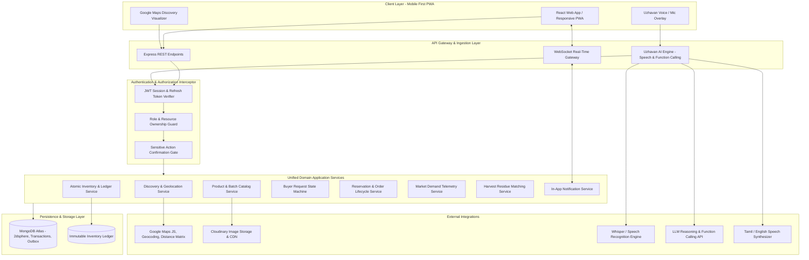

---

### Diagram B: Buyer Journey
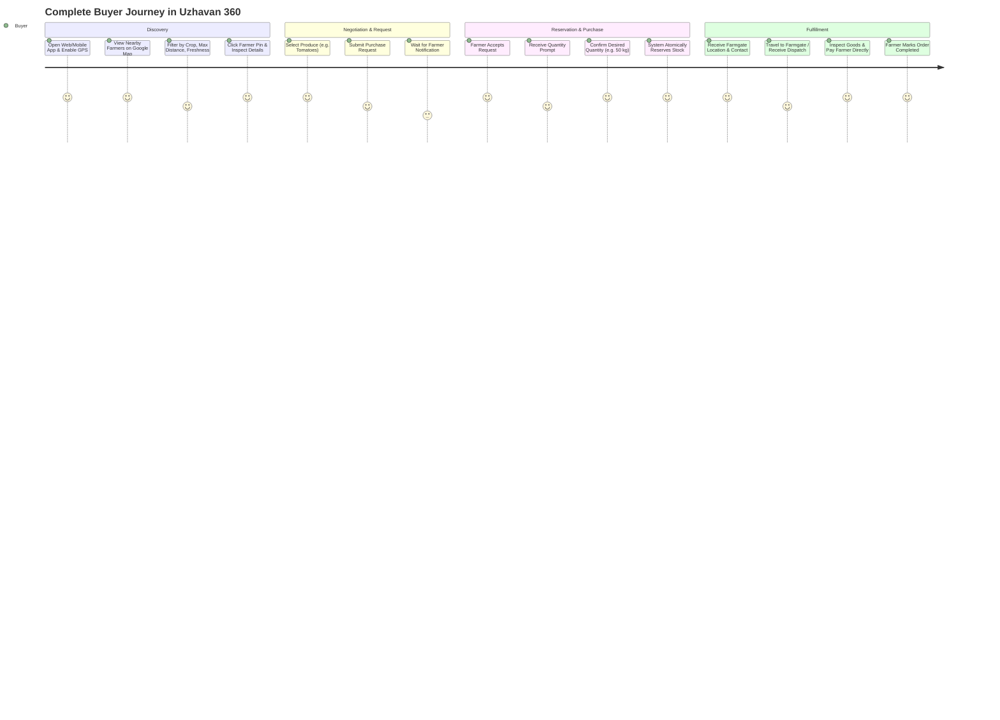

---

### Diagram C: Farmer Journey
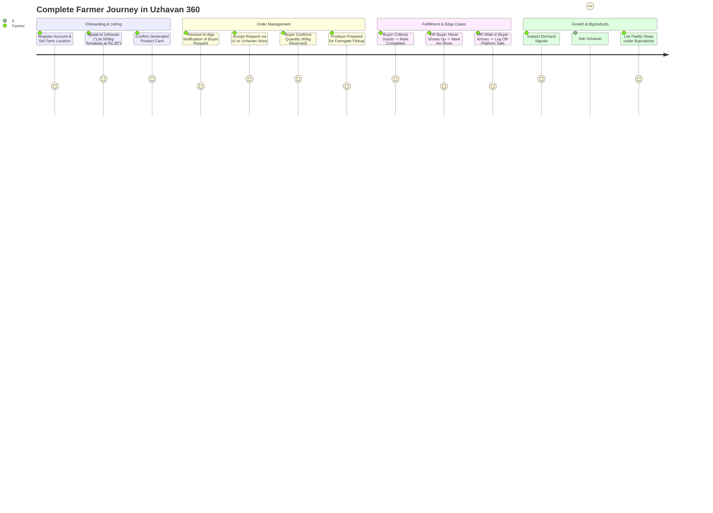

---

### Diagram D: Uzhavan AI Architecture
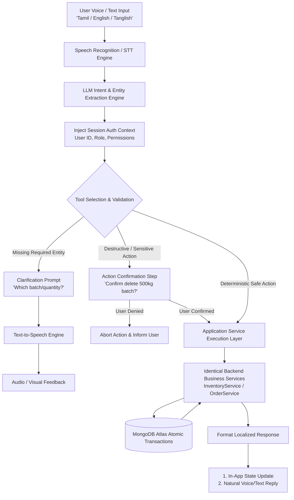

---

### Diagram E: Request Lifecycle
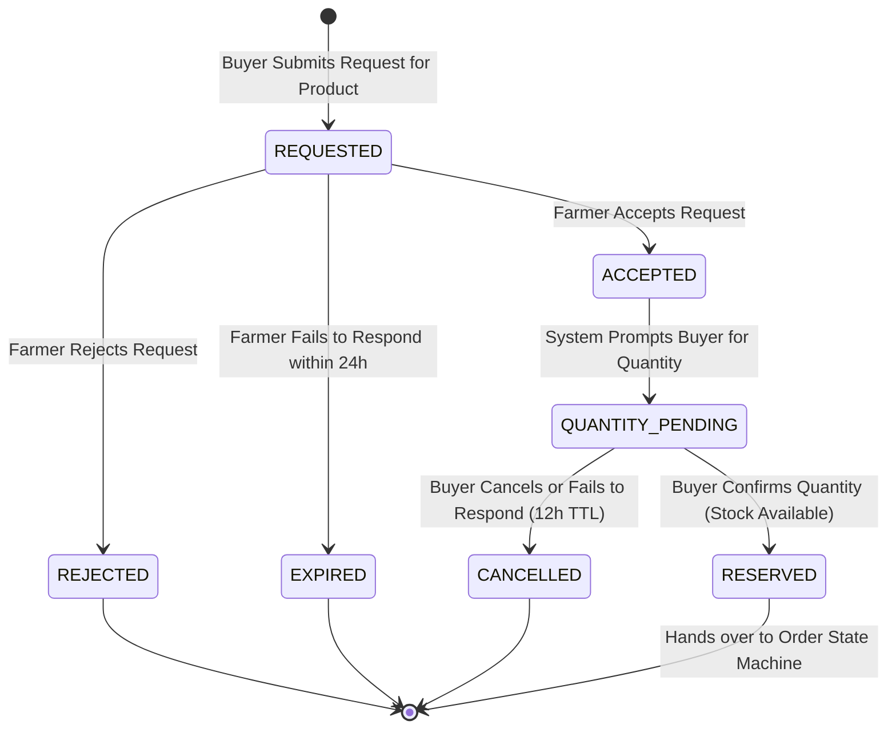

---

### Diagram F: Order Lifecycle
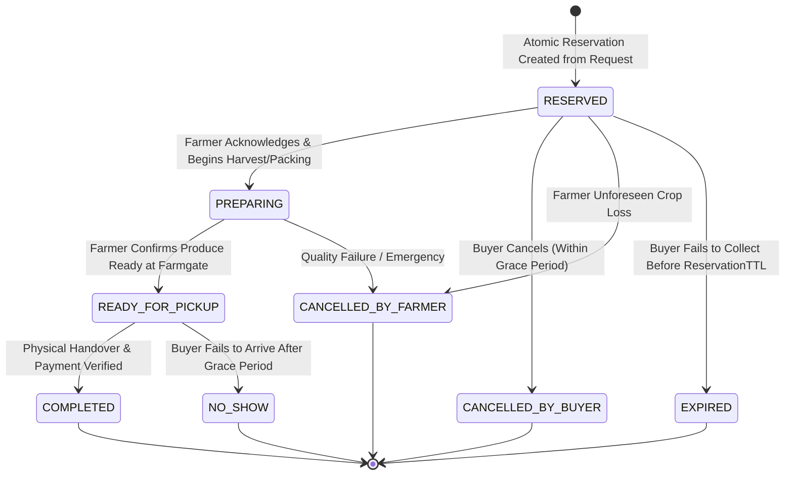

---

### Diagram G: Inventory Lifecycle
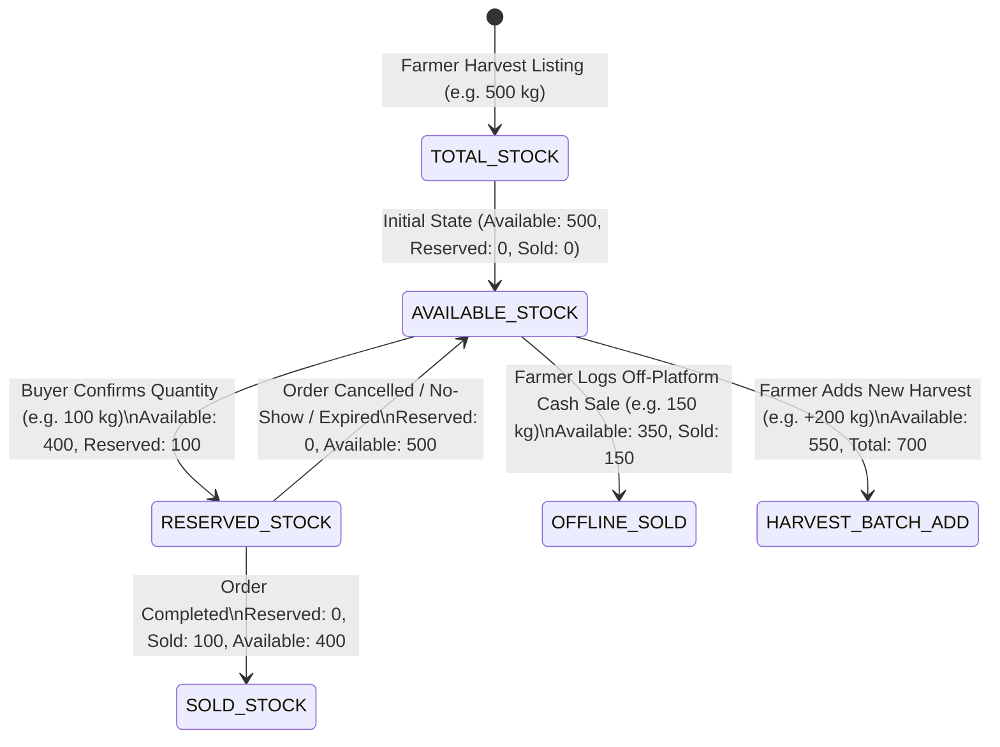

---

### Diagram H: Marketplace + Google Maps Flow
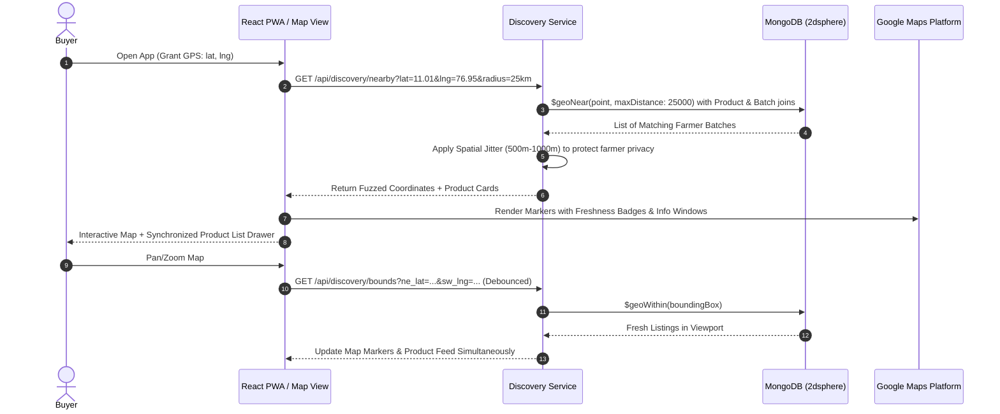

---

### Diagram I: Demand Intelligence Flow
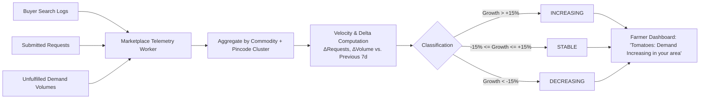

---

### Diagram J: Harvest Byproduct Flow
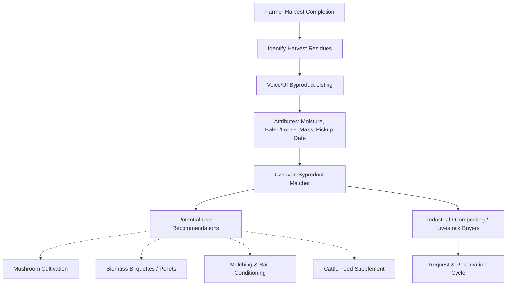

---

### Diagram K: Manual vs. Uzhavan Control Flow
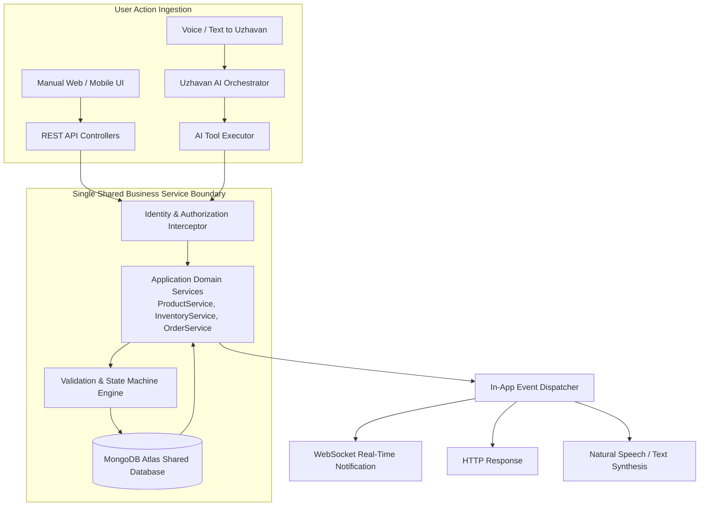

---

### Diagram L: External Integrations
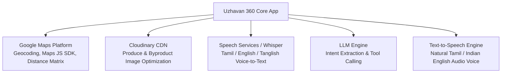

---

# 40. Resolution of 20 Critical Business Rules

1. **When buyer sends a request, does inventory change?**  
   *Resolution:* **No.** Submitting a request indicates interest only. No inventory is locked, deducted, or reserved. Inventory remains 100% available to other buyers.
2. **When farmer accepts, when is quantity requested?**  
   *Resolution:* Immediately upon farmer acceptance, the request enters `ACCEPTED` / `QUANTITY_PENDING`, and the buyer receives an urgent in-app prompt to input their exact required volume.
3. **When is inventory reserved?**  
   *Resolution:* Inventory is reserved **only when the buyer submits their required quantity** and the backend validates that $Q_{\text{requested}} \le Q_{\text{available}}$. An atomic reservation lock is then applied with an attached 12-hour expiration window.
4. **When does reserved stock become sold?**  
   *Resolution:* Reserved stock becomes sold **only when the farmer marks the order `COMPLETED`** upon physical produce handover and payment collection at the farmgate.
5. **What happens on buyer no-show?**  
   *Resolution:* The farmer marks `NO_SHOW`. The system cancels the order, decrements $Q_{\text{reserved}}$, increments $Q_{\text{available}}$ via the ledger, returns the produce to the open market, and increments the buyer's internal no-show counter.
6. **What happens when farmer cancels after acceptance?**  
   *Resolution:* If cancelled before quantity confirmation, the request is simply terminated. If cancelled after reservation, the reserved stock is atomically restored to available stock, the buyer is notified immediately, and the farmer must provide a mandatory operational reason.
7. **What happens when farmer sells externally?**  
   *Resolution:* The farmer uses UI or tells Uzhavan (*"Sold 50 kg offline"*). The system validates $Q_{\text{sold}} \le Q_{\text{available}}$, decrements $Q_{\text{available}}$, increments $Q_{\text{sold}}$, and logs an `OFFLINE_SALE` ledger entry.
8. **What happens to an accepted request with no quantity confirmation?**  
   *Resolution:* An accepted request has a strict 12-hour TTL. If the buyer fails to input a quantity within 12 hours, the request automatically transitions to `EXPIRED`. Zero inventory is impacted.
9. **Can orders be partially fulfilled?**  
   *Resolution:* **Yes.** During final completion, if the actual weighed harvest is less than reserved ($Q_{\text{actual}} < Q_{\text{reserved}}$), the fulfilled amount moves to `SOLD`, and the remaining difference is atomically restored to $Q_{\text{available}}$.
10. **Can a farmer have multiple harvest batches?**  
    *Resolution:* **Yes.** A farmer can maintain multiple distinct batches for the same commodity (e.g., Batch 1 harvested Sept 20, Batch 2 harvested Sept 24), each with independent harvest timestamps, prices, and inventory ledgers.
11. **Can one product have different harvest dates?**  
    *Resolution:* **Yes**, modeled as individual `ProductBatch` entities attached to a parent `Product` catalog commodity.
12. **What happens when stock reaches zero?**  
    *Resolution:* When $Q_{\text{available}} = 0$, the product batch is automatically hidden from public discovery map and search feeds, while remaining visible in the farmer's private dashboard with an `OUT_OF_STOCK` badge.
13. **Can a farmer add a new harvest to existing inventory?**  
    *Resolution:* If the harvest date is identical, they can append quantity via a `BATCH_ADDITION` ledger entry. If the harvest date is different, the system mandates creating a new batch to preserve freshness scoring integrity.
14. **What happens when an AI action is interrupted?**  
    *Resolution:* If a voice session disconnects mid-conversation before explicit confirmation or tool dispatch, **zero backend mutations occur**. The session rolls back cleanly.
15. **Which actions require confirmation?**  
    *Resolution:* (1) Deleting a product/byproduct listing; (2) Rejecting or cancelling an order; (3) Logging an offline sale exceeding 50% of available stock; (4) Executing bulk actions via "Sell My Harvest".
16. **What happens when two buyers compete for the same stock?**  
    *Resolution:* Resolved atomically at the database level via conditional write locks. The first transaction to commit successfully claims the stock; the competing transaction receives an immediate HTTP 409 Conflict informing the buyer that stock was just secured by another party.
17. **What happens when an order is completed but notification fails?**  
    *Resolution:* The business state transition (`COMPLETED`) is primary and commits. The notification failure is caught, logged to an outbox retry table, and retried asynchronously without rolling back the order completion.
18. **What happens if database update fails halfway?**  
    *Resolution:* Multi-document mutations (e.g., updating batch counts and writing ledger logs) execute inside an atomic MongoDB Session Transaction. If any operation fails, the entire transaction aborts, leaving the database pristine.
19. **What happens when the farmer deletes a product with active requests/orders?**  
    *Resolution:* **Strictly forbidden.** If $Q_{\text{reserved}} > 0$ or pending requests exist, the deletion endpoint returns an error. The farmer can only deactivate discovery ($Q_{\text{available}} = 0$) until all active commitments are completed or formally resolved.
20. **What information is safe to show on Google Maps?**  
    *Resolution:* **Safe:** Approximate location (500m–1000m fuzzed circle), Farmer First Name, Verification Status, Available Products, Price, Quantity, Freshness Tier, and Distance. **Unsafe (Hidden until confirmed reservation):** Exact farmgate street address, exact house number, personal phone number, and financial details.

---

# 41. Architecture Stress Test & Quality Control Verification

To ensure that the architecture is watertight prior to Level 2 implementation, the following edge cases were evaluated:

1. **Can two buyers reserve the same stock?**  
   *Verdict:* **Impossible.** Stock deduction uses atomic database conditional predicates (`available: { $gte: requestedQty }`).
2. **Can inventory become negative?**  
   *Verdict:* **Impossible.** Guarded by the database condition $Q_{\text{available}} \ge Q_{\text{req}}$ and validation rules enforcing non-negative numbers across all fields.
3. **Can cancelled stock be double-restored?**  
   *Verdict:* **Impossible.** State machine strictly permits transition from `RESERVED` to `CANCELLED` exactly once. Re-executing returns an invalid state transition error.
4. **Can a no-show incorrectly reduce inventory?**  
   *Verdict:* **Impossible.** The `NO_SHOW` transition only releases reserved stock ($\Delta Q_{\text{reserved}} = -Q, \Delta Q_{\text{available}} = +Q$). It never decrements available stock.
5. **Can a sold product be accidentally restored?**  
   *Verdict:* **Impossible.** The `COMPLETED` state is terminal. There is no state transition path from `COMPLETED` to `CANCELLED` or `AVAILABLE`.
6. **Can a farmer sell externally and keep incorrect online quantity?**  
   *Verdict:* **Impossible if logged.** The offline sale tool directly decrements $Q_{\text{available}}$ atomically.
7. **Can one buyer create duplicate requests?**  
   *Verdict:* **Impossible.** The system enforces a unique compound index on `{ buyerId, productId, status: 'REQUESTED' }`.
8. **Can a farmer accept twice?**  
   *Verdict:* **Impossible.** State transition guard allows acceptance only when current state is strictly `REQUESTED`.
9. **Can a buyer cancel twice?**  
   *Verdict:* **Impossible.** Order state must be `RESERVED` to permit cancellation. Once cancelled, subsequent attempts fail.
10. **Can a farmer modify another farmer's product?**  
    *Verdict:* **Impossible.** Ownership authorization middleware verifies `req.user.id === product.farmerId` on all write routes and AI tool handlers.
11. **Can a buyer modify another buyer's order?**  
    *Verdict:* **Impossible.** Ownership middleware verifies `req.user.id === order.buyerId`.
12. **Can AI perform unauthorized actions?**  
    *Verdict:* **Impossible.** AI tool handlers inherit the user's verified JWT session context and execute through the identical RBAC security gates.
13. **Can AI confuse two farmers with the same name?**  
    *Verdict:* **Impossible.** The AI resolves entities using unique MongoDB ObjectIDs passed through session context or disambiguates by prompting the user for location/crop details.
14. **Can map location and marketplace data become inconsistent?**  
    *Verdict:* **Impossible.** The map and list share a single synchronized Redux/Context state driven by identical geo-spatial queries.
15. **Can an order reach an impossible state?**  
    *Verdict:* **Impossible.** All transitions are strictly validated against the finite state machine whitelist.
16. **Can partial fulfillment work reliably?**  
    *Verdict:* **Yes.** Governed by mathematical ledger reconciliation releasing unused reserved inventory back to available stock.
17. **Can a new harvest be added smoothly?**  
    *Verdict:* **Yes.** Via batch creation or atomic batch addition ledger operations.
18. **Can notification failure corrupt business state?**  
    *Verdict:* **Impossible.** State mutations commit independently of notification delivery; notifications are queued in an asynchronous outbox.
19. **Can network retry duplicate an action?**  
    *Verdict:* **Impossible.** Idempotency keys discard duplicate incoming requests.
20. **Can the MVP realistically be built within scope?**  
    *Verdict:* **Yes.** The architecture avoids microservice sprawl, container orchestration complexity, and speculative external dependencies, focusing on a clean, robust Modular Monolith.

---
*End of Level 1 Architecture Specification — Single Source of Truth for Uzhavan 360.*
